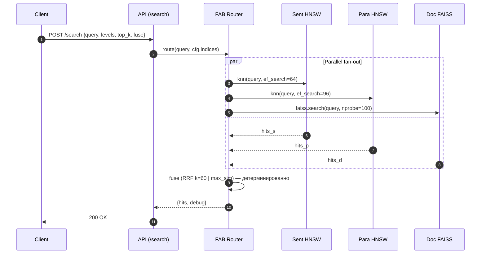
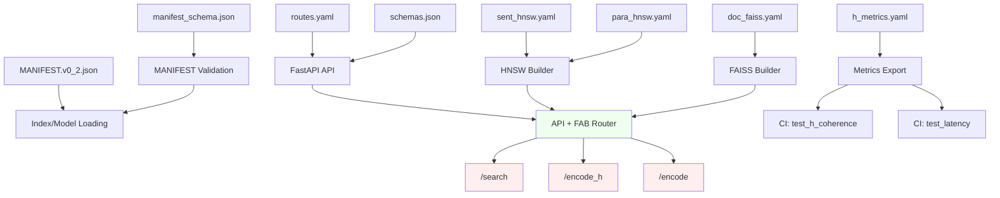

# Atlas β — Wiring Diagram

## Обзор слоёв

```
Client → API (FastAPI) → FAB (stateless) → Indices (HNSW/FAISS) → Storage (models, manifest)
```

Каждый слой читает конфиги через `ConfigLoader` и является детерминированным.

---

## Поток 1: `/search` (multi-level fusion)



**Конфиги:**
- `src/atlas/configs/api/routes.yaml` → `/search` path, defaults (top_k=10, fuse="RRF")
- `src/atlas/configs/indices/sent_hnsw.yaml` → ef_search=64
- `src/atlas/configs/indices/para_hnsw.yaml` → ef_search=96
- `src/atlas/configs/indices/doc_faiss.yaml` → nprobe=100

**Инвариант:** Идентичный ввод (query, levels, top_k, fuse) → всегда идентичный результат (RRF детерминирован).

---

## Поток 2: `/encode_h` (hierarchical embeddings)

```
┌─────────────────────────────────────────────┐
│           Hierarchical Encoding              │
├─────────────────────────────────────────────┤
│                                             │
│  Text Input                                 │
│     ↓                                       │
│  Tokenize (из schema)                       │
│     ↓                                       │
│  ┌─────────────────────────────────────┐   │
│  │ Teacher Model (L2-normalized)       │   │
│  ├─────────────────────────────────────┤   │
│  │ Token embeddings (384-dim)    ←─────┼─┐ │
│  │ Sentence embeddings (384-dim) ←──┐ │ │ │
│  │ Paragraph embeddings (384-dim)   │ │ │ │
│  │ Document embeddings (384-dim)    │ │ │ │
│  └──────────────┬────────────────────┘ │ │ │
│                 ↓                      │ │ │
│  Projectors:                           │ │ │
│  · proj_384 (sent→384)    ←────────────┘ │ │
│  · proj_768 (doc→768)     ←──────────────┘ │
│                 ↓                          │
│  Level masking:                            │
│  · token_to_sent [0,0,1,1,2,2,...]        │
│  · sent_to_para [0,0,1,1,2,...]           │
│                 ↓                          │
│  Response JSON                             │
│  {                                         │
│    "levels": {                             │
│      "sentence": [[...], [...], ...],      │
│      "paragraph": [[...], [...]],          │
│      "document": [[...]]                   │
│    },                                      │
│    "proj_384": [...],                      │
│    "proj_768": [...],                      │
│    "masks": {...}                          │
│  }                                         │
└─────────────────────────────────────────────┘
```

**Конфиги:**
- `src/atlas/configs/api/routes.yaml` → `/encode_h` path
- `src/atlas/configs/api/schemas.json` → EncodeHierarchicalRequest/Response
- `MANIFEST.v0_2.json` → teacher model weights, proj_384/768 shapes

**Инвариант:** Одинаковый текст → одинаковое разбиение на токены/предложения/параграфы → одинаковые embeddings.

---

## Поток 3: `/encode` (rule-based 5D)

```
┌───────────────────────────────────────────┐
│         Rule-Based 5D Encoding            │
├───────────────────────────────────────────┤
│                                           │
│ Input: {text, metadata}                   │
│     ↓                                     │
│ Rule-based Encoder:                       │
│  · Parse metadata (A: authority)          │
│  · Text length → B (brevity score)        │
│  · Topic extraction → C (category)        │
│  · Sentiment/tone → D (disposition)       │
│  · Format/structure → E (encoding style)  │
│     ↓                                     │
│ Output: [a, b, c, d, e]                   │
│  (each 0–255, 5D hyperplane)              │
│     ↓                                     │
│ 5D Operations:                            │
│  · union([a1,b1,c1,d1,e1], [a2,...])     │
│  · intersect([...], [...])                │
│  · route by e (format selector)           │
│     ↓                                     │
│ Response: {vector, metadata_enriched}    │
└───────────────────────────────────────────┘
```

**Конфиги:**
- `src/atlas/configs/api/routes.yaml` → `/encode` path
- `src/atlas/configs/api/schemas.json` → EncodeRequest/Response
- Rule definitions (internal in encoder, but driven by configs)

**Инвариант:** Идентичные метаданные → одинаковые 5D координаты.

---

## Контракты и конфигурационные источники

| Компонент | Конфиг | Назначение |
|-----------|--------|-----------|
| **API маршруты** | `routes.yaml` | Endpoints, defaults, rate_limit |
| **API схемы** | `schemas.json` | Pydantic validators (request/response) |
| **HNSW парамы** | `sent_hnsw.yaml`, `para_hnsw.yaml` | M, ef_construction, ef_search |
| **FAISS парамы** | `doc_faiss.yaml` | nlist, m, nbits, nprobe |
| **Метрики пороги** | `h_metrics.yaml` | H-Coherence, H-Stability, latency targets |
| **Манифест схема** | `manifest_schema.json` | Валидирует MANIFEST.v0_2.json |
| **Артефакты** | `MANIFEST.v0_2.json` | Версии моделей, SHA256, совместимость |

Все конфиги загружаются **один раз при старте** через `ConfigLoader` (read-only).

---

## Инварианты проводки

1. **FAB без состояния**
   - Нет памяти о прошлых запросах, кэше внутри роутера.
   - Кэш может быть только вне FAB (например, в Redis, со своей инвалидацией).

2. **Все fuse — детерминированы**
   - RRF: score = Σ 1/(rank_i + 60) → сортировка → reproducible.
   - max_sim: поэлементный max → reproducible.
   - Без random, без softmax, без выборки по вероятностям.

3. **Только L2-нормированные векторы**
   - Все embeddings из teacher — L2-норм.
   - cosine(u, v) = dot(u, v) при ||u||=||v||=1.
   - Кэш нормировки в MANIFEST (sha256 эмбеддингов).

4. **MANIFEST верификация**
   - При загрузке сервис проверяет MANIFEST.v0_2.json против `manifest_schema.json`.
   - Любое рассинхронизирование версий → panic, не запуск.

---

## Быстрые проверки

### Запустить валидацию
```bash
python scripts/validate_baseline.py --strict
```

### Запустить smoke-тест
```bash
python scripts/smoke_test_wiring.py
```

### Оба сразу (из Makefile)
```bash
make validate smoke
```

---

## Диаграмма зависимостей



